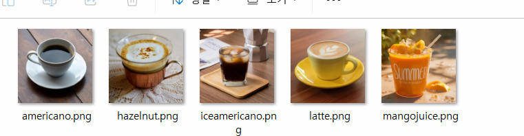
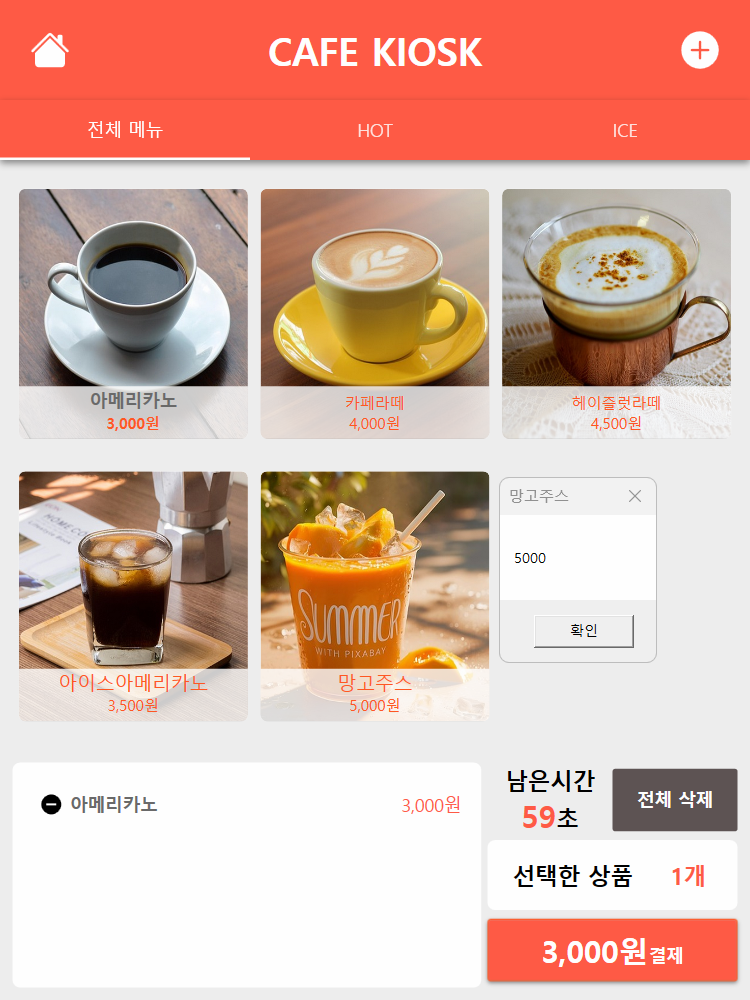

# 2026 닷넷 개발자 데스크톱 개발

## WPF 실습

### 카페 키오스크 개발

- 사용 스펙

  - WPF (.NET 10.0)
  - MaterialDesign (MaterialDesignThemes)
  - MySQL + DBeaver

#### 프로젝트 생성

- WpfCafeKiosk
- NuGet Package, MaterialDesignThemes, MySQLConnector 설치
- MahApps.Metro.IconPacks 추가 설치
- 

#### 프로젝트 구성

- WPF 머티리얼디자인 적용
- 키오스크 UI 제작
- 메뉴 모델, 주문 모델 생성
- 메뉴버튼 하드코딩
- MySQL menu 테이블 생성
- DB에서 메뉴 조회
- 메뉴버튼 동적생성
- 주문목록, 총액 계산

#### MaterialDesign 적용

* App.xaml에 리소스딕셔너리 적용

#### MySQL DB, Table 생성

* cafekiosk 데이터베이스 생성
* menu 테이블 생성
* orders, order_detail 테이블 생성

```sql
CREATE TABLE menu
(
    menu_id INT PRIMARY KEY AUTO_INCREMENT,  
    menu_name VARCHAR(100) NOT NULL,  
    price INT NOT NULL,  
    image_path VARCHAR(255),
    category VARCHAR(20),
    is_sale CHAR(1) DEFAULT 'Y'
);

CREATE TABLE orders
(
    order_id INT PRIMARY KEY AUTO_INCREMENT,
    order_date DATETIME NOT NULL DEFAULT CURRENT_TIMESTAMP,
    total_count INT NOT NULL,
    total_amount INT NOT NULL
);

CREATE TABLE order_detail
(
    detail_id INT PRIMARY KEY AUTO_INCREMENT,
    order_id INT NOT NULL,
    menu_id INT NOT NULL,
    menu_name VARCHAR(100) NOT NULL,
    price INT NOT NULL,
    count INT NOT NULL,
    total_price INT NOT NULL,
    CONSTRAINT fk_order_detail_orders
        FOREIGN KEY (order_id)
        REFERENCES orders(order_id)
);
```


#### 모델 클래스

* MenuItem - DB menu테이블과 매핑
* OrderItem - 주문리스트 저장

#### 이미지 작업

- Pixbay등 사이트에서 다운로드
- 일부 편집
- Images 폴더에 붙여넣기



#### MainWindow UI 작업 및 기본 이벤트



#### 메뉴 옵션 팝업창 작업


#### 기본 동작 이벤트 구현

https://github.com/user-attachments/assets/3fab497c-5e01-4800-bcfa-f0301174ea63

### 카페 키오스크 구현 리스트

- [X] 옵션 팝업창에서 수량 선택한 내용 주문담기 버튼 기능구현
- [X] 키오스크 리스트뷰 음료 리스트업
- [X] 선택한 상품, 결제버튼 비용, 갯수연동
- [X] 전체 삭제 기능
- [X] 남은 시간 완료 후 전체내용 초기화
- [X] 홈 버튼 클릭 초기화
- [X] 메인창에서 옵션창으로 MenuId 전달
- [ ] DB연동!! 메뉴 SELECT /주문내역 INSERT
- [X] 메뉴 동적 바인딩!!

#### 옵션창 주문내역 확인


- `Tag={Binding}` - 객체 자체의미, OrderItem 객체 자체. 하위에서 MenuName, Count 등 사용 가능
- Margin, Padding 위치 순서 - Left, Top, Right, Bottom / Left&Right, Top&Bottom 순서
- CornerRadius 위치 순서 - TopLeft, TopRight, BottomRight, BottomLeft / TopLeft&BottomRight, TopRight&BottomLeft 순서

#### 실행결과

https://github.com/user-attachments/assets/1003c297-420b-46f2-8b83-9a4a416dee7e


### OpenAPI 연동앱 개발

### SmartHome 솔루션

## Unity 실습
