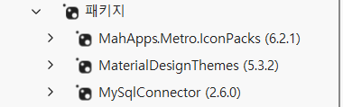
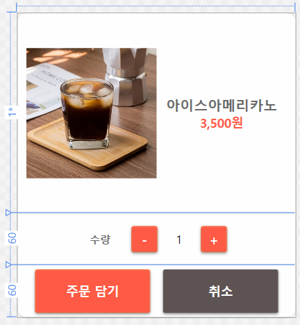

# 2026 닷넷 개발자 데스크톱 개발

## WPF 실습

### 카페 키오스크 개발

- 사용 스펙
  - WPF (.NET 10.0)
  - MaterialDesign (MaterialDesignInXamlToolkit)
  - MySQL + DBeaver

### 프로젝트 생성

- WpfCafe
- NuGet Package, MaterialDesignThemes, MySQLConnector 설치
- MahApps.Metro.IconPacks 추가 설치
  

### 프로젝트 구성

- WPF 머티리얼디자인 적용
- 키오스크 UI 제작
- 메뉴 모델, 주문 모델 생성
- 메뉴버튼 하드코딩
- MySQL menu 테이블 생성
- DB에서 메뉴 조회
- 메뉴버튼 동적생성
- 주문목록, 총액 계산

### MaterialDesign 적용

- App.xaml에 리소스딕셔너리 적용

### MySQL DB, Table 생성

- cafekiosk 데이터 생성
- menu 테이블 생성

```sql
CREATE TABLE menu
(
    menu_id INT PRIMARY KEY AUTO_INCREMENT,
    menu_name VARCHAR(100) NOT NULL,
    price INT NOT NULL,
    image_path VARCHAR(255),
    category VARCHAR(20),
    is_sale CHAR(1) DEFAULT 'Y'
);

```

#### 모델 클래스
- MenuItem - DB menu테이블과 매핑
- OrderItem - 주문리스트 저장

### 이미지 작업
- Pixbay등 사이트에서 다운로드
- 일부 편집
- Images 폴더에 붙여넣기


#### MainWindow UI 작업 및 기본 이벤트


### 메뉴 옵션 팝업창 작업



#### 기본 동작 이벤트 구현

### OpenAPI 연동앱 개발
