# 2026 닷넷 개발자 데스크톱 개발

## 2. Unity 실습

### 2.1. 유니티 학습

- https://learn.unity.com/ 튜토리얼대로 따라하기
- Keijro Takahashi Github : https://github.com/keijiro
- 이전버전 https://unity.com/kr/releases/editor/archive 확인 다운로드 설치

#### Get started with Unity

- Tutorial 순서대로 따라하기

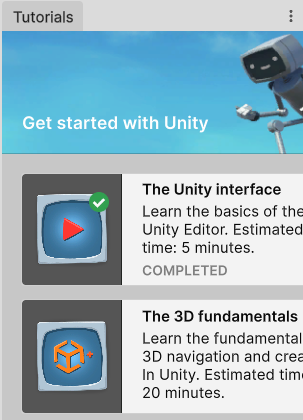

- 1번 챕터 완료후 

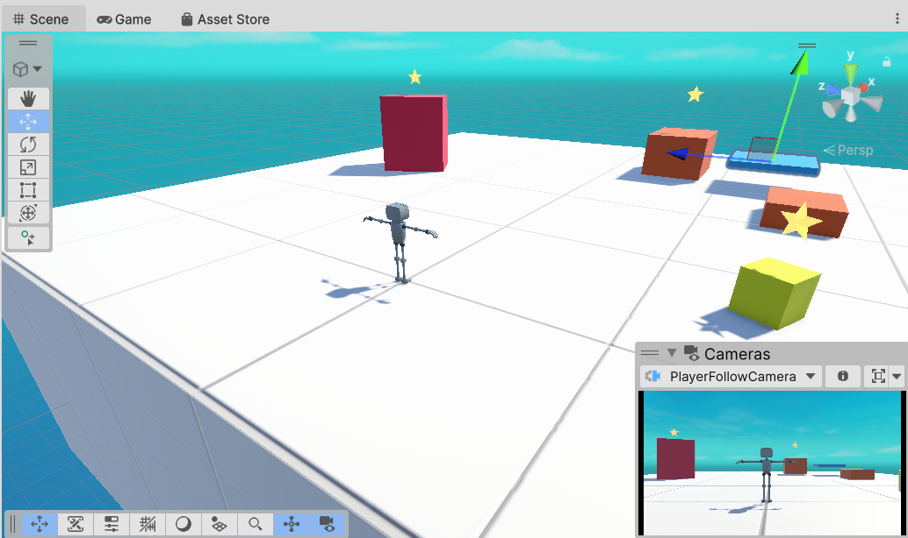

### 2.1. Essentials PathWay

- 가장 짧은 시간에 Unity 학습할 수 있는 튜토리얼

#### Essentials Pathy Template


- 템플릿 다운로드 우선
- 프로젝명, 프로젝트 위치 선택 프로젝트 생성

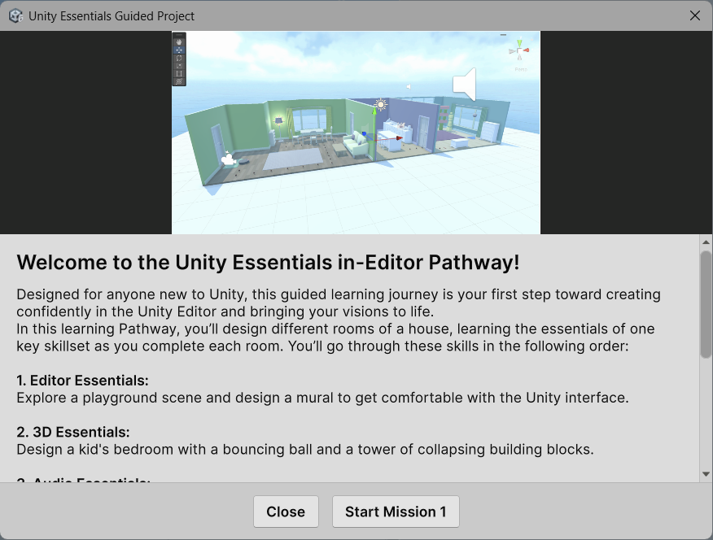

#### 화면/시점 이동

- 방향키, WSAD
- Mouse Right, Wheel
- Flythrough Mode : Mouse Right + WSAD / EQ

- Object 선택 후 F 클릭(오브젝트 더블클릭)

#### Pan Tool

- 오브젝트 위치, 회전, 크기 등을 조절할 수 있는 아이콘 툴바

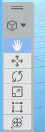

- View, Move, Rotate, Scale, Rect, Transform까지 여섯개 아이콘
- 단축키 : Q,W,E,R,T,Y

#### 오브젝트 위치(Position), 회전(Rotation), 크기(Scale) 조정

- Inpector에서 Position x,y,z 값을 입력 또는 마우스로 좌우 드래그 형태로 변경
- Rotation, Scale 동일하게 적용


#### Kid's Room 꾸미기

- 방 오브젝트
- 침대, 카페트, 협탁, 알람시계, 침실조명 등 위치 및 회전, 크기 조정

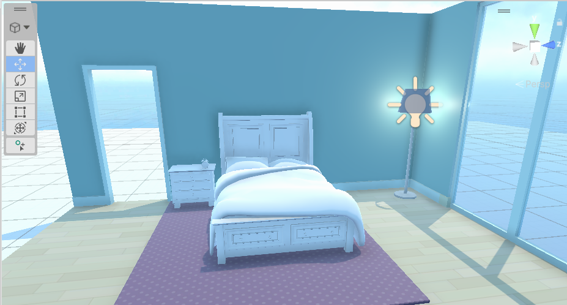

#### Material

- 오브젝트 재질 표현 객체
- Material 객체 생성 후 Inspector에서 조정


- Material 객체를 Ball 객체에 드래그


#### RigidBody

- 물리역학 기능 제공 컴포넌트
- Ball 선택 Inspector에서 Add Component 버튼 클릭

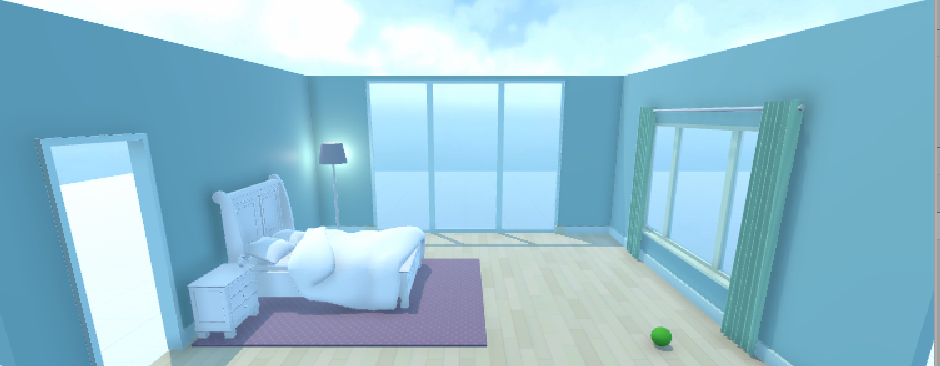

#### Physics Material

- 물체가 충돌할 때 마찰력, 반발력을 설정하는 자산
- Bounciness : 1 완전 탄성 충돌
  - 0.1(쇠구슬), 0.7(축구공), 0.9(고무공)

#### Ramp Object 추가

- 위치, 회전 지정
- Mesh Collider 컴포넌트 추가

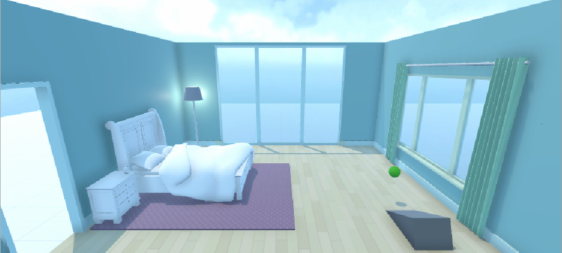

#### Block 객체 생성

- Cube로 생성
- Scale x,y,z를 0.1, 0.25 0.1로 설정, Ball이 튕겨서 닿는 위치에 
- Rigid Body 추가

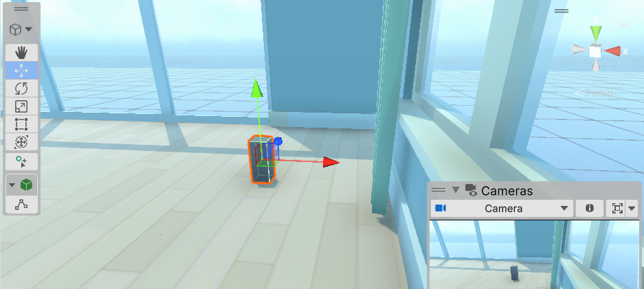

#### 카메라 시점 변환

- Flythrough 모드로 이동 후
- 카메라 오브젝트 선택
- Ctrl+Shift+F : 현 카메라 시점을 플레이 카메라 시점으로 변경

#### 프리팹 변경

- Prefabs 폴더 내에 기존 Object 드래그하면 Prefab으로 변경

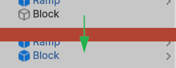

#### Block 쌓기

- Pivot을 Center로 변경 후
- 프리팹 Block을 쌓아올림

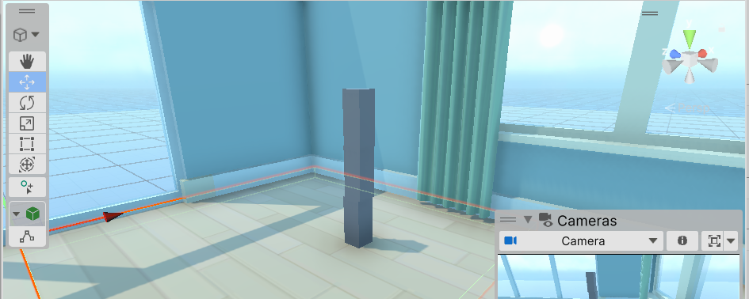

#### 프리팹 편집모드

- 프로젝트 창의 프리팹을 더블클릭
- Inspector 수정
- RigidBody > mass를 1보다 작게 수정(0.1)
- 충돌하는 물체의 mass에 상대적 반응
- Hierarchy 창의 < 버튼 클릭

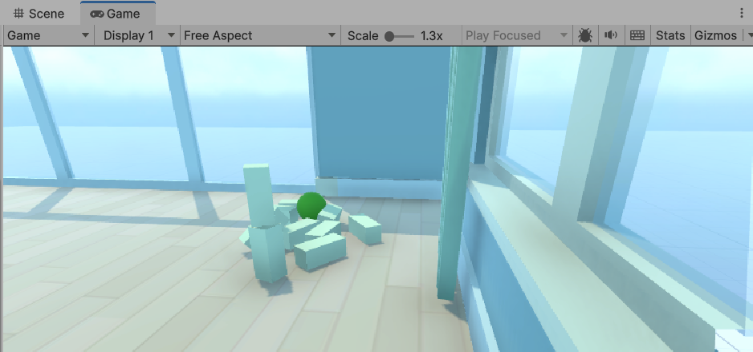

#### 라리트, 스카이박스 조정

- 라이트
  - y, z 축으로 낮밤 조정 가능
  - Emission > Color 조정 빛 색상조절
    - Emission > Light Appearance, Filter and Temperature 선택후 
    - 빛의 온도를 조정


- 스카이박스 
  - 하늘 전체 배경 변경 
  - Materials > Skyboxes의 Material을 씬뷰에 드래그 

#### 플레이모드 구분짓기

- Preferences > Colors > Play mode tints 색상을 어두운색으로 변경
- Play시 UI 색상이 Edit모드와 다르게 표시

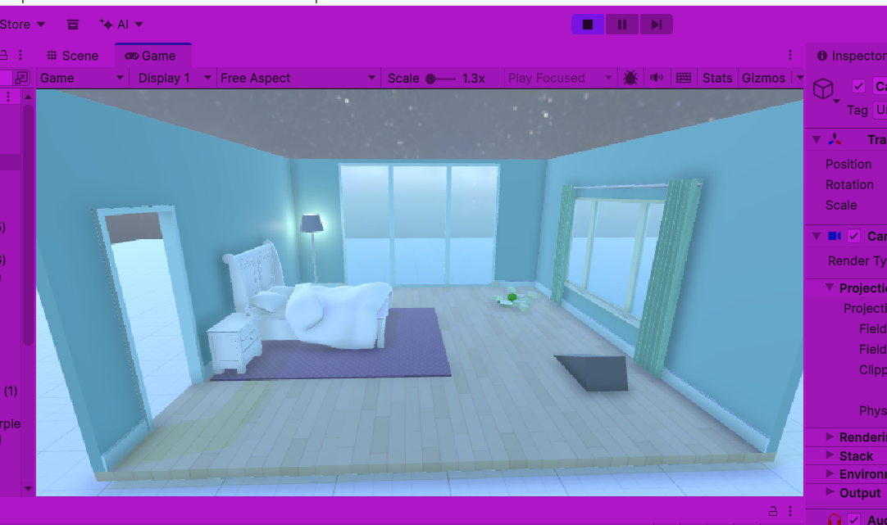

#### 피벗기능

- Object를 쌓을때 v를 누르면 Object의 기준점 변경됨

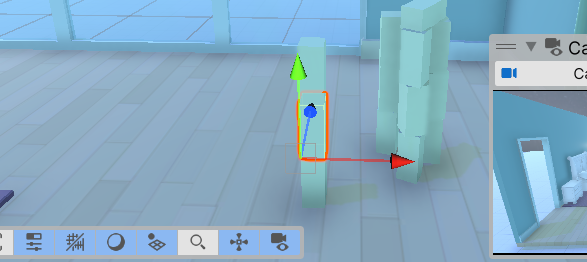

#### Chapter 2


#### Chapter 3 Audio Effect

- 냄비 프리팹 선택, 가스레인지 위 위치
- Audio Source 컴포넌트 추가
- Audio Generator 선택, Loop 체크
- Spatial Blend : 2D ~ 3D로 변경


#### Unity 오브젝트 복사

- Ctrl + D : 선택한 오브젝트가 바로 복사

#### 단축키

- 메뉴 Edit > Shortcuts...

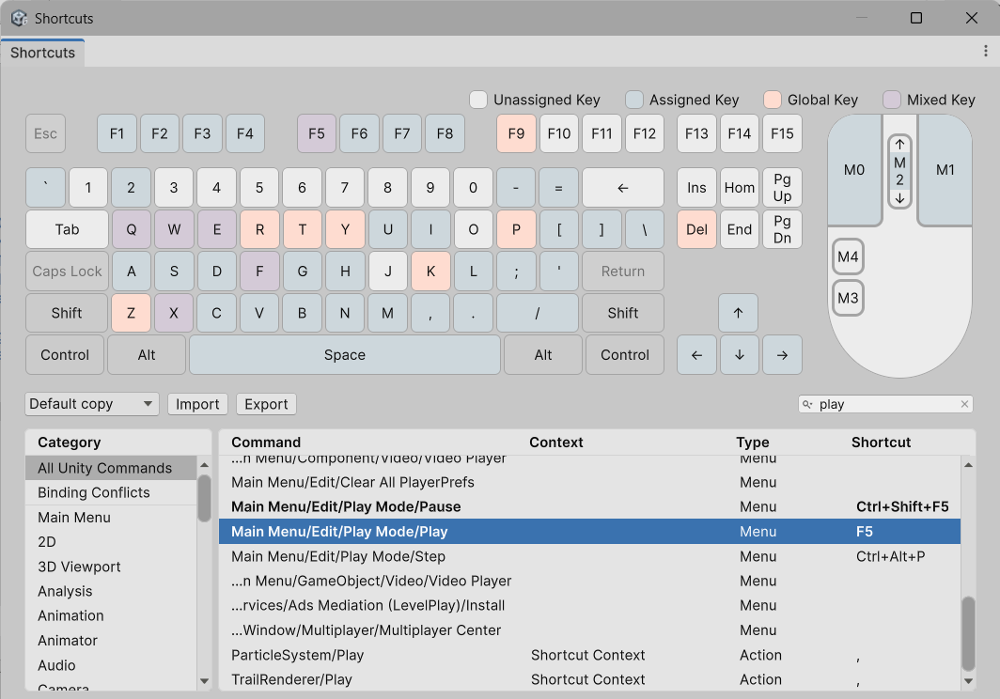

#### 배경음악, 새소리

- 계층창에서 Audio Source 선택
- 알맞은 사운드 Audio Generator에 선택
- 시작하면서 바로 음악 플레이하고 싶으면
  - Play on Awake 체크
- 새소리 처럼 랜덤하게 플레이하고 싶으면
  - Play on Awake 체크해제
  - PlaySoundAtRandomIntervals 스크립트 추가
  - Min/Max Seconds 램덤시간 지정


#### Chaper 4. Programming
- 유니티 개발시 가장 핵심!

- Player 오브젝트 위치, 회전, 크기 조정
- PlayerController 스크립트 생성, Player 드래그

- 입력시스템 변경
  - Project Settings > Player > Other Settings > `Active Input Handling`, Old 또는 `Both`로 변경 후 에디터 재시작

#### 카메라 플레이어 Child 지정

- Main Camera, Player 하위로 드래그
- 카메라 위치 Reset 뒤 위치, 회전 수정
 
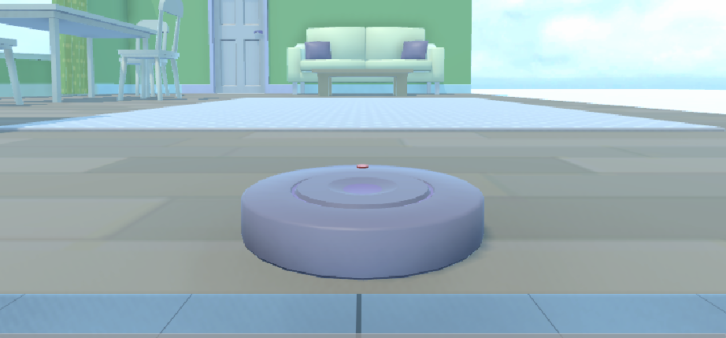

- 방 아래 Cube까지 화면에 출력. 위치 조정 잘 해줘야 플레이시 카메라 진동X

#### 플레이모드 변수값 변경

- Speed : 5.0f, RotationSpeed : 120.0f
- 플레이시 이동속가 빠름
- 플레이모드 변수값 수정하면서 알맞은 속도 확인
- Speed : 0.3f, RotationSpeed : 70.0f 이 적당함
- Inspector에 지정된 스크립트 Reset

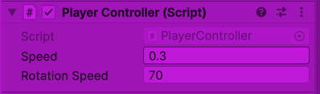

#### 아이템 코인 오브젝트

- Prefabs 폴더에서 Collectible Coin 드래그, 위치, 사이즈 조정
- Collectable.cs 스크립트 생성

- Coin에 Box Collider > `Is Trigger` 체크
- 충돌은 발생하지 않고, 충돌감지 기능 활성화


- Collectable.cs에 OnTriggerEnter 메서드 추가


```cs
public class Collectable : MonoBehaviour
{
    [Header("회전 설정")]
    [Tooltip("프레임당 회전 속도")]
    [Range(0, 10)]
    public float rotationSpeed = 0.5f;

    [Tooltip("아이템 획득시 이펙트지정")]
    public GameObject collectEffect;

    // Update is called once per frame
    void Update()
    {
        transform.Rotate(0, rotationSpeed, 0);  // 매프레임마다 y축을 0.5f씩 회전
    }

    // 물체끼지 충돌이 발생했을때 이벤트처리
    private void OnTriggerEnter(Collider other)
    {
        Destroy(gameObject);  // 코인 삭제

        Instantiate(collectEffect, transform.position, transform.rotation);
    }
}
```

#### 점프기능 추가

- PlayerController.cs에 공용변수, Update() 추가

```cs
[Tooltip("점프강도")]
public float jumpForce = 3.0f;

// 입력처리, 카메라... Frame별 실행
// LateUpdate() : Update() 후에 실행되는 메서드. 카메라 추적
private void Update()
{
    if (Keyboard.current.spaceKey.wasPressedThisFrame)
    {
        rb.AddForce(Vector3.up * jumpForce, ForceMode.VelocityChange);
    }
}
```

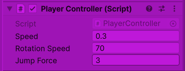

- Play후 Space 누르면 점프 확인


#### 생생형 AI 활용 밤낮처리 추가

- 프롬프트로 요청
```text
유니티에서 Directional Light를 조정해서 밤낮으로 바뀌는 스크립트를 작성해줘. 20초에 한번씩 해가지고 다시 뜨도록 만들어줘. DayNightCycle.cs로 만들어줘
```

- 만들어진 스크립트

```cs
using UnityEngine;

public class DayNightCycle : MonoBehaviour
{
    [Header("Directional Light")]
    public Light sun;

    [Header("Cycle Settings")]
    [Tooltip("낮→밤→낮 한 바퀴 도는 시간(초)")]
    public float cycleDuration = 20f;

    private float currentTime;

    private void Update()
    {
        if (sun == null) return;
        // 시간 증가
        currentTime += Time.deltaTime;
        // 0 ~ 1 반복
        float normalizedTime = (currentTime % cycleDuration) / cycleDuration;
        // 0 ~ 360도 회전
        float sunAngle = normalizedTime * 360f;
        transform.rotation = Quaternion.Euler(sunAngle - 90f, 170f, 0f);
        // 빛 세기 조절
        float intensity = Mathf.Clamp01(
            Mathf.Cos((normalizedTime - 0.25f) * Mathf.PI * 2f)
        );
        sun.intensity = intensity;
    }
}
```

- Directional Light 오브젝트에 할당
- 변수 Sun Directional Light 할당


- Tutorial 스크립트 방식

```cs
  [Header("회전 속도 설정")]
  public float rotationSpeed = 1f;

  [Header("시간 설정")]
  [Tooltip("하루(24시간)가 지나는데 걸리는 실제 시간(초)")]
  public float dayDuration = 60f;

  private float timePassed = 0.0f;

  void Start()
  {
      rotationSpeed = Mathf.Abs(rotationSpeed);
  }

  void Update()
  {
      float angleToRotate =
          (360.0f / dayDuration) * Time.deltaTime;

      transform.Rotate(
          Vector3.right,
          angleToRotate * rotationSpeed);

      timePassed += Time.deltaTime;

      if (timePassed >= dayDuration)
      {
          timePassed = 0.0f;
      }
  }
```

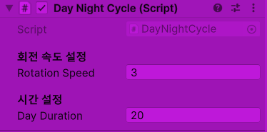

#### 방문열기 기능

- DoorOpener.cs 생성
- Door 루트오브젝트에 스크립트 지정
- Box Collider 추가 Is Trigger 체크 후 위치, 크기 수정
- 튜토리얼에 있는 스크립트 붙여넣기
- Player 객체에 Tag 콤보박스에서 `Player` 태그를 선택


#### 코인 획득 사운드 추가

- Collectable.cs에 소스 추가

```cs
[Header("이펙트 사운드")]
public AudioClip pickupSound;

// 물체끼지 충돌이 발생했을때 이벤트처리
private void OnTriggerEnter(Collider other)
{
    if (other.CompareTag("Player"))
    {
        AudioSource.PlayClipAtPoint(pickupSound, transform.position); // 뾰롱소리
        Destroy(gameObject);  // 코인 삭제
        Instantiate(collectEffect, transform.position, transform.rotation); // 파티클 이펙트 실행
    }       
}
```

- 프리팩의 코인을 선택, Script 내 pickupSound 설정

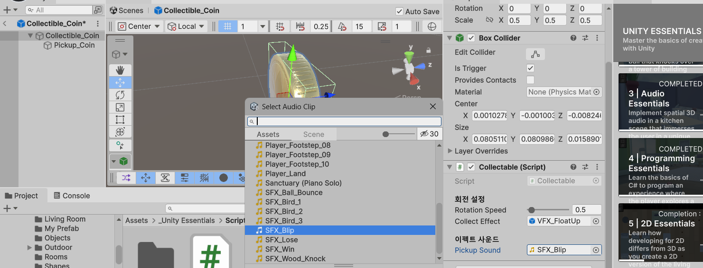


#### Chapter 6. 배포하기

- UI(Canvas) 메뉴에서 선택


#### 빌드 시 사용할 신리스트 설정

- 메뉴 File > Build Profiles 선택
- 필요한 씬 Scene List에 추가

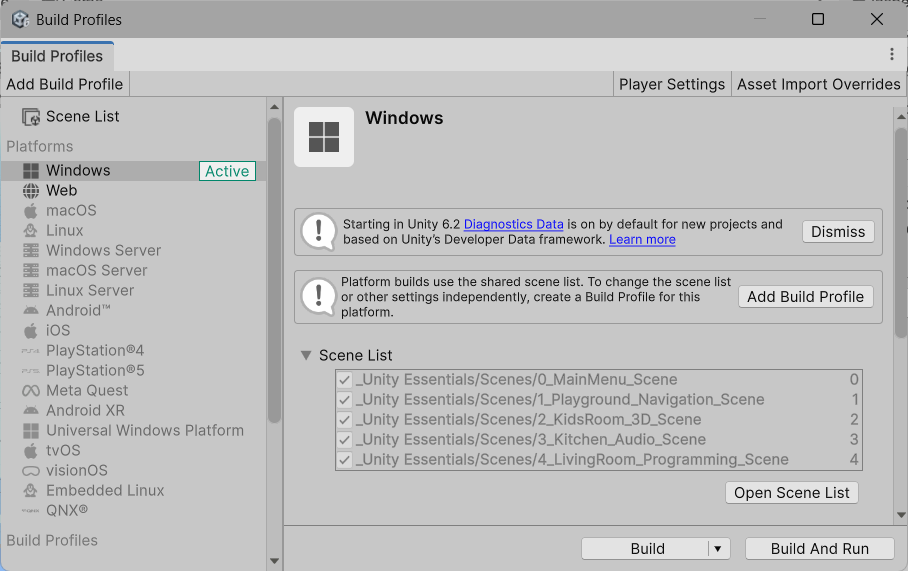

- 플레이어 셋팅 작업
  - Company Name, Product Name, Version, Default Icon
  - Resolution > Windowed, Width, Height 설정

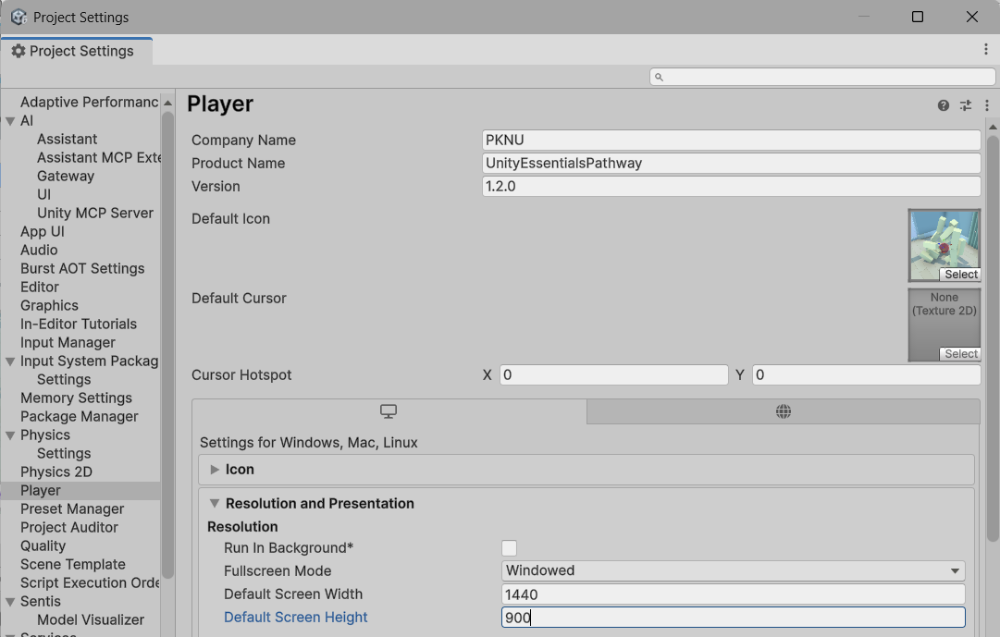

- Build Profiles > Build 또는 Build And Run 버튼 클릭 빌드 진행


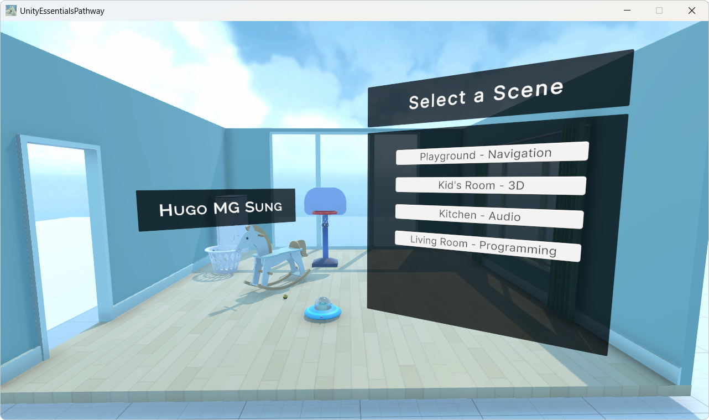

- 메뉴 클릭 신 이동, ESC키로 메뉴 리턴

- 유니티 UI Canvas > Button Inspector 속성
- On Click 이벤트...


---

### 2.2. Unity Factory

- Unity Technologies Japan에서 제공하는 무료 HDRP 공장 시뮬레이션 에셋
- 공장건물부터 컨베이어라인, 로봇팔, 작업자, 조명...
- https://assetstore.unity.com/ 에서 `Unity Factory` 검색

#### 프로젝트 생성

- HighDefition 3D(HDRP) 프로젝트 생성
- My Assets에서 Unity Factory 검색 후 Import

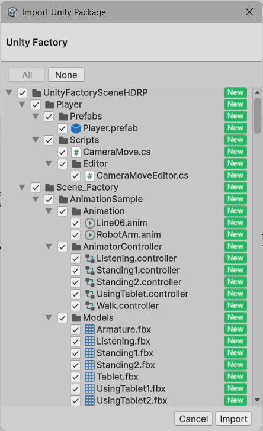

- Import 후 오류 발생
  - SplineContainer 에러
    - Package Manager > Unity Registry, `Splines` 검색 후 설치
  - Input System 오류
    - 키보드, 마우스 입력 시스템이 Unity 6부터 변경
    - 예전 방식 입력시스템 사용
    - Project Settings > Player > Other Settings > `Active Input Handling`, Old 또는 `Both`로 변경 후 에디터 재시작

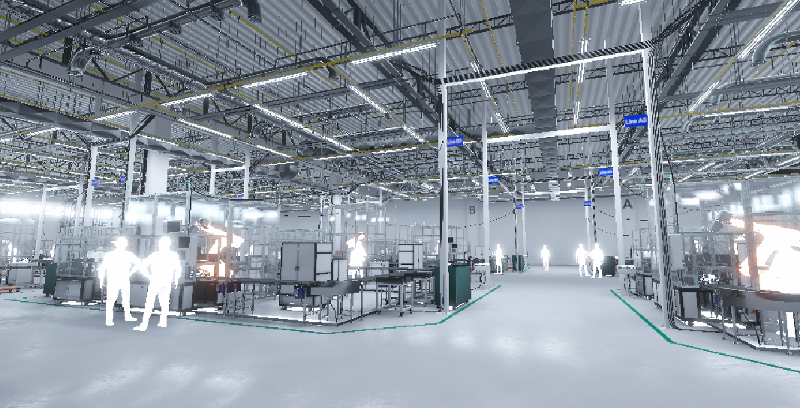

- Global Volume 오브젝트, 사용체크 비활성화


