# 2026 닷넷 개발자 데스크톱 개발

## 2. Unity 실습

### 2.1. 유니티 학습

- https://learn.unity.com/ 튜토리얼대로 따라하기
- Keijro Takahashi Github : https://github.com/keijiro
- 이전버전 https://unity.com/kr/releases/editor/archive 확인 다운로드 설치

#### Get started with Unity

- Tutorial 순서대로 따라하기


- 1번 챕터 완료후 


### 2.1. Essentials PathWay

- 가장 짧은 시간에 Unity 학습할 수 있는 튜토리얼

#### Essentials Pathy Template


- 템플릿 다운로드 우선
- 프로젝명, 프로젝트 위치 선택 프로젝트 생성


#### 화면/시점 이동

- 방향키, WSAD
- Mouse Right, Wheel
- Flythrough Mode : Mouse Right + WSAD / EQ

- Object 선택 후 F 클릭(오브젝트 더블클릭)

#### Pan Tool

- 오브젝트 위치, 회전, 크기 등을 조절할 수 있는 아이콘 툴바


- View, Move, Rotate, Scale, Rect, Transform까지 여섯개 아이콘
- 단축키 : Q,W,E,R,T,Y

#### 오브젝트 위치(Position), 회전(Rotation), 크기(Scale) 조정

- Inpector에서 Position x,y,z 값을 입력 또는 마우스로 좌우 드래그 형태로 변경
- Rotation, Scale 동일하게 적용


#### Kid's Room 꾸미기

- 방 오브젝트
- 침대, 카페트, 협탁, 알람시계, 침실조명 등 위치 및 회전, 크기 조정


#### Material

- 오브젝트 재질 표현 객체
- Material 객체 생성 후 Inspector에서 조정


- Material 객체를 Ball 객체에 드래그


#### RigidBody

- 물리역학 기능 제공 컴포넌트
- Ball 선택 Inspector에서 Add Component 버튼 클릭


#### Physics Material

- 물체가 충돌할 때 마찰력, 반발력을 설정하는 자산
- Bounciness : 1 완전 탄성 충돌
  - 0.1(쇠구슬), 0.7(축구공), 0.9(고무공)

#### Ramp Object 추가

- 위치, 회전 지정
- Mesh Collider 컴포넌트 추가


#### Block 객체 생성

- Cube로 생성
- Scale x,y,z를 0.1, 0.25 0.1로 설정, Ball이 튕겨서 닿는 위치에 
- Rigid Body 추가


#### 카메라 시점 변환

- Flythrough 모드로 이동 후
- 카메라 오브젝트 선택
- Ctrl+Shift+F : 현 카메라 시점을 플레이 카메라 시점으로 변경

#### 프리팹 변경

- Prefabs 폴더 내에 기존 Object 드래그하면 Prefab으로 변경


#### Block 쌓기

- Pivot을 Center로 변경 후
- 프리팹 Block을 쌓아올림


#### 프리팹 편집모드

- 프로젝트 창의 프리팹을 더블클릭
- Inspector 수정
- RigidBody > mass를 1보다 작게 수정(0.1)
- 충돌하는 물체의 mass에 상대적 반응
- Hierarchy 창의 < 버튼 클릭


#### 라리트, 스카이박스 조정

- 라이트
  - y, z 축으로 낮밤 조정 가능
  - Emission > Color 조정 빛 색상조절
    - Emission > Light Appearance, Filter and Temperature 선택후 
    - 빛의 온도를 조정


- 스카이박스 
  - 하늘 전체 배경 변경 
  - Materials > Skyboxes의 Material을 씬뷰에 드래그 

#### 플레이모드 구분짓기

- Preferences > Colors > Play mode tints 색상을 어두운색으로 변경
- Play시 UI 색상이 Edit모드와 다르게 표시


#### 피벗기능

- Object를 쌓을때 v를 누르면 Object의 기준점 변경됨


#### Chapter 2


#### Chapter 3 Audio Effect

- 냄비 프리팹 선택, 가스레인지 위 위치
- Audio Source 컴포넌트 추가
- Audio Generator 선택, Loop 체크
- Spatial Blend : 2D ~ 3D로 변경


#### Unity 오브젝트 복사

- Ctrl + D : 선택한 오브젝트가 바로 복사

#### 단축키

- 메뉴 Edit > Shortcuts...


#### 배경음악, 새소리

- 계층창에서 Audio Source 선택
- 알맞은 사운드 Audio Generator에 선택
- 시작하면서 바로 음악 플레이하고 싶으면
  - Play on Awake 체크
- 새소리 처럼 랜덤하게 플레이하고 싶으면
  - Play on Awake 체크해제
  - PlaySoundAtRandomIntervals 스크립트 추가
  - Min/Max Seconds 램덤시간 지정


#### Chaper 4. Programming
- 유니티 개발시 가장 핵심!

- Player 오브젝트 위치, 회전, 크기 조정
- PlayerController 스크립트 생성, Player 드래그

- 입력시스템 변경
  - Project Settings > Player > Other Settings > `Active Input Handling`, Old 또는 `Both`로 변경 후 에디터 재시작

#### 카메라 플레이어 Child 지정

- Main Camera, Player 하위로 드래그
- 카메라 위치 Reset 뒤 위치, 회전 수정
 


- 방 아래 Cube까지 화면에 출력. 위치 조정 잘 해줘야 플레이시 카메라 진동X

#### 플레이모드 변수값 변경

- Speed : 5.0f, RotationSpeed : 120.0f
- 플레이시 이동속가 빠름
- 플레이모드 변수값 수정하면서 알맞은 속도 확인
- Speed : 0.3f, RotationSpeed : 70.0f 이 적당함
- Inspector에 지정된 스크립트 Reset


#### 아이템 코인 오브젝트

- Prefabs 폴더에서 Collectible Coin 드래그, 위치, 사이즈 조정
- Collectable.cs 스크립트 생성

- Coin에 Box Collider > `Is Trigger` 체크
- 충돌은 발생하지 않고, 충돌감지 기능 활성화


- Collectable.cs에 OnTriggerEnter 메서드 추가


```cs
public class Collectable : MonoBehaviour
{
    [Header("회전 설정")]
    [Tooltip("프레임당 회전 속도")]
    [Range(0, 10)]
    public float rotationSpeed = 0.5f;

    [Tooltip("아이템 획득시 이펙트지정")]
    public GameObject collectEffect;

    // Update is called once per frame
    void Update()
    {
        transform.Rotate(0, rotationSpeed, 0);  // 매프레임마다 y축을 0.5f씩 회전
    }

    // 물체끼지 충돌이 발생했을때 이벤트처리
    private void OnTriggerEnter(Collider other)
    {
        Destroy(gameObject);  // 코인 삭제

        Instantiate(collectEffect, transform.position, transform.rotation);
    }
}
```

#### 실행화면

https://github.com/user-attachments/assets/a1255594-b84e-4120-b15b-37b113ea0f49

#### 점프기능 추가

- PlayerController.cs에 공용변수, Update() 추가

```cs
[Tooltip("점프강도")]
public float jumpForce = 3.0f;

// 입력처리, 카메라... Frame별 실행
// LateUpdate() : Update() 후에 실행되는 메서드. 카메라 추적
private void Update()
{
    if (Keyboard.current.spaceKey.wasPressedThisFrame)
    {
        rb.AddForce(Vector3.up * jumpForce, ForceMode.VelocityChange);
    }
}
```


- Play후 Space 누르면 점프 확인


#### 생생형 AI 활용 밤낮처리 추가

- 프롬프트로 요청
```text
유니티에서 Directional Light를 조정해서 밤낮으로 바뀌는 스크립트를 작성해줘. 20초에 한번씩 해가지고 다시 뜨도록 만들어줘. DayNightCycle.cs로 만들어줘
```

- 만들어진 스크립트

```cs
using UnityEngine;

public class DayNightCycle : MonoBehaviour
{
    [Header("Directional Light")]
    public Light sun;

    [Header("Cycle Settings")]
    [Tooltip("낮→밤→낮 한 바퀴 도는 시간(초)")]
    public float cycleDuration = 20f;

    private float currentTime;

    private void Update()
    {
        if (sun == null) return;
        // 시간 증가
        currentTime += Time.deltaTime;
        // 0 ~ 1 반복
        float normalizedTime = (currentTime % cycleDuration) / cycleDuration;
        // 0 ~ 360도 회전
        float sunAngle = normalizedTime * 360f;
        transform.rotation = Quaternion.Euler(sunAngle - 90f, 170f, 0f);
        // 빛 세기 조절
        float intensity = Mathf.Clamp01(
            Mathf.Cos((normalizedTime - 0.25f) * Mathf.PI * 2f)
        );
        sun.intensity = intensity;
    }
}
```

- Directional Light 오브젝트에 할당
- 변수 Sun Directional Light 할당


- Tutorial 스크립트 방식

```cs
  [Header("회전 속도 설정")]
  public float rotationSpeed = 1f;

  [Header("시간 설정")]
  [Tooltip("하루(24시간)가 지나는데 걸리는 실제 시간(초)")]
  public float dayDuration = 60f;

  private float timePassed = 0.0f;

  void Start()
  {
      rotationSpeed = Mathf.Abs(rotationSpeed);
  }

  void Update()
  {
      float angleToRotate =
          (360.0f / dayDuration) * Time.deltaTime;

      transform.Rotate(
          Vector3.right,
          angleToRotate * rotationSpeed);

      timePassed += Time.deltaTime;

      if (timePassed >= dayDuration)
      {
          timePassed = 0.0f;
      }
  }
```


#### 방문열기 기능

- DoorOpener.cs 생성
- Door 루트오브젝트에 스크립트 지정
- Box Collider 추가 Is Trigger 체크 후 위치, 크기 수정
- 튜토리얼에 있는 스크립트 붙여넣기
- Player 객체에 Tag 콤보박스에서 `Player` 태그를 선택


#### 코인 획득 사운드 추가

- Collectable.cs에 소스 추가

```cs
[Header("이펙트 사운드")]
public AudioClip pickupSound;

// 물체끼지 충돌이 발생했을때 이벤트처리
private void OnTriggerEnter(Collider other)
{
    if (other.CompareTag("Player"))
    {
        AudioSource.PlayClipAtPoint(pickupSound, transform.position); // 뾰롱소리
        Destroy(gameObject);  // 코인 삭제
        Instantiate(collectEffect, transform.position, transform.rotation); // 파티클 이펙트 실행
    }       
}
```

- 프리팩의 코인을 선택, Script 내 pickupSound 설정


#### Chapter 6. 배포하기

- UI(Canvas) 메뉴에서 선택


#### 빌드 시 사용할 씬리스트 설정

- 메뉴 File > Build Profiles 선택
- 필요한 씬 Scene List에 추가


- 플레이어 셋팅 작업
  - Company Name, Product Name, Version, Default Icon
  - Resolution > Windowed, Width, Height 설정


- Build Profiles > Build 또는 Build And Run 버튼 클릭 빌드 진행


- 메뉴 클릭 신 이동, ESC키로 메뉴 리턴

- 유니티 UI Canvas > Button Inspector 속성
- On Click 이벤트...


---

### 2.2. 3D 모델 불러오기

#### 렌더링 파이프라인

- 오브젝트 생성, 카메라 확인, 빛 계산, 그림자 계산, 재질 생성/계산, 후처리 후 모니터 출력 등의 순서과정

#### Built-In / SRP 

- Built-in - Unity가 렌더링 방식 고정. 수정 어려움
- SRP(Scriptable Render Pipeline) - Unity는 뼈대만 제공, 개발자가 원하는 렌더링을 추가하는 방식

#### 프로젝트 구분

- 렌더링 파이프라인 종류 3가지 구분

|종류 | 성능 | 그래픽품질 | 모바일/VR지원 |
|---|---|---|---|
|Built-in | 보통 | 보통 | 보통 |
|URP | 좋음 | 좋음 | 좋음 |
|HDRP | 낮음(고사양) | 매우 좋음 | 제한적 | 

- 기본적으로 Built-in으로 학습

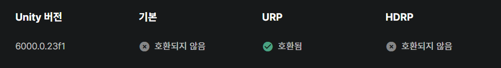

- 에셋스토어에서 제공하는 에셋의 RP 종류 확인하고 사용할 것

#### 3D 모델 활용방법

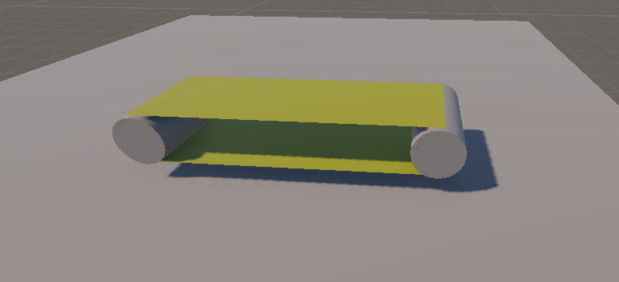

- 유니티에서는 3D 모델링이 아주 제한적
- 3D 모델 활용방법
    - Blender 무료 3D 모델링 툴에서 작업한 모델 import
    - 3D Max, Rhino 사용 모델링 툴 작업 모델 import
    - Unity Asset Store에서 제공하는 3D 모델 import
    - 생성형 AI로 모델 생성 import

#### 3D 모델 가져오기

- https://www.cgtrader.com 
- https://poly.pizza/ (low polygon model)
- https://sketchfab.com/

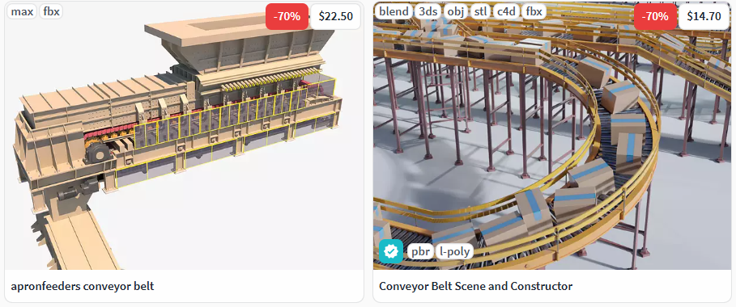

- 호환되는 파일 포맷
    - `FBX` : Autodesk 3D(AutoCAD) 교환 포맷. Unity 가장 호환
    - `OBJ` : 범용 정적 모델 포팻, Unity 사용 가능
    - STL : 3D 프린터용 포맷, 비추천
    - BLEND : Blender 원본 파일. 애니메이션 기능 포함. 가능(Blender 설치)
    - 3DS : 구형 AutoDesk 3D Studio 모델, 사용 가능

- 스케치팹 사이트 > Conveyor Belt 검색 > 로그인 후 다운로드

- 압축해제, fbx, 텍스처를 프로젝트 Assets 폴더 아래 이동

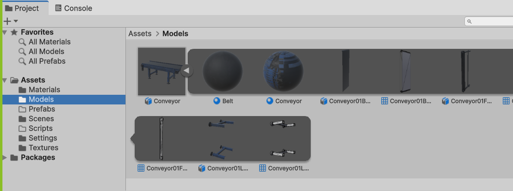

- Models 폴더에 위치한 Conveyor를 Scene뷰에 드래그

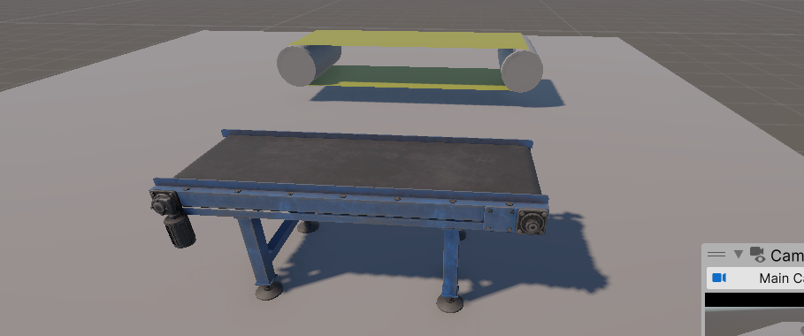

---

### 2.3. 생산라인 구축

#### 생산품 박스

- Cube 오브젝트로 생성
- 구글에서 `Plastic Normal Map` 검색
- 텍스쳐 이미지 저장 > Assets > Textures 아래 위치
- Material 생성, Base Map 앞 사각형에 텍스처를 드래그
- Rigid Body 추가

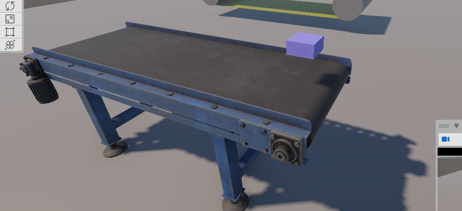

#### 컨베이어 벨트 물리컴포넌트

- Belt 에만 Collider 추가
    - Mesh Collider : 3D 모델 폴리곤 메시 개수만큼 충돌영역지정. 리소스 부하
    - `Box Collider` : 큐브형태로 충돌영역지정. 부하적음

#### 컨베이어 벨트 스크립트

- ConveyorBelt.cs 스크립트 생성
- 충돌이 감지되는 동안 물체이동 로직

```cs
using UnityEngine;   // 유니티 엔진 클래스

// MonoBehaviour C# 스크립트가 기본적으로 상속받는 핵심 클래스
// 개발자코드가 유니티 엔진과 인터렉티브하게 소통할 수 있도록 
// 오브젝트에 컴포넌트로 연결, 동작을 제어
public class ConveyorBelt : MonoBehaviour {
    [Header("물체이동 방향")]
    public Vector3 moveDirection = Vector3.right;

    [Header("물체이동 속도")]
    public float speed = 2.0f;

    // 매 프레임 두 충돌영역이 접촉하고 있는 동안 발생 이벤트핸들러
    private void OnCollisionStay(Collision collision) {
        Rigidbody rb = collision.rigidbody; // 충돌감지된 오브젝트 리지드바디 가져오기

        if (rb != null) {
            rb.linearVelocity = moveDirection.normalized * speed;  // 이동방향으로 속도만큼 이동
        }
    }
}
```

- 컨베이어 오브젝트 중 Collider 컴포넌트 적용한 벨트에 스크립트 할당
- 플레이 테스트 후 방향 변경

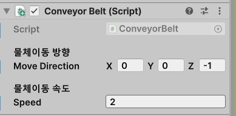

#### Box Spawner 생성

- 박스를 일정시간마다 하나씩 생성하도록 하는 기능
- Product 박스, 컨베이어를 프리팹으로 이동
- EmptyObject 생성, 위치를 이전 Product 위치로 지정
- BoxSpawner.cs 스크립트

```cs
public class BoxSpawner : MonoBehaviour {
    [Header("프리팹 지정")]
    public GameObject prdPrefab;
    [Header("생성 간격")]
    public float interval = 3.0f;

    float timer;

    void Update() {
        timer += Time.deltaTime;   // HW 성능별 FPS 고정

        if (timer >= interval) {
            timer = 0;
            // instant 예제, 샘플
            // Quaternion.identity 회전값 없는 상태
            Instantiate(prdPrefab,
                        transform.position,
                        Quaternion.identity);
        }
    }
}
```

- Spawner 빈오브젝트에 스크립트 할당

#### 실행결과

https://github.com/user-attachments/assets/33c491e5-cb2b-4611-976e-b5caecdde8ee

#### 컨베이어 벨트 여러개 구성

- 프리팹 드래그 추가

#### 컨베이어 벨트 멈추기 기능

- ConveyorBelt.cs 오픈
- 로직 변경

```cs
using UnityEngine;

public class ConveyorBelt : MonoBehaviour {
    ...
    [Header("벨트 동작여부")]
    public bool isRunning = true;
    
    private void OnCollisionStay(Collision collision) {
        Rigidbody rb = collision.rigidbody;

        if (rb == null) return; 
        if (!isRunning) {
            rb.linearVelocity = Vector3.zero; // 0으로 초기화
            return;
        }

        rb.linearVelocity = moveDirection.normalized * speed;
    }

    public void Stop() {
        isRunning = false;  // 중지
    }

    public void StartBelt() {
        isRunning = true;  // 재시작
    }
}
```

- 벨트 동작여부 체크 확인

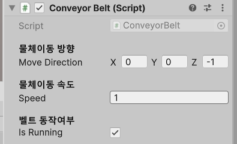

- 컨베이어 끝에 센서가 있다고 가정. Collider 트리거 발생하면 멈춤기능
- 빈 오브젝트 생성 > `Sensor` 명명
- Sensor 오브젝트 > `Box Collider` 컴포넌트 추가. `Is Trigger` 체크
- `Edit Collider` 아이콘 클릭 위치, 크기 조정

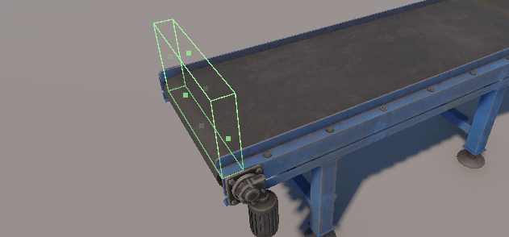

- SensorTrigger.cs 스크립트 생성

```cs
public class SensorTrigger : MonoBehaviour {
    // 다른 Collider가 들어와서 Trigger 발생하면?
    private void OnTriggerEnter(Collider other) {
        Debug.Log("제품 감지!");
    }
}
```
- Sensor 객체에 스크립트 추가
- 콘솔로 변경, 실행

- SensorTrigger.cs 스크립트 재 수정

```cs
public class SensorTrigger : MonoBehaviour {
    [Header("컨베이어 1")]
    public ConveyorBelt conveyor1;
    [Header("컨베이어 2")]
    public ConveyorBelt conveyor2;
    private bool isProcessing = false;
    
    private void OnTriggerEnter(Collider other) {
        if (isProcessing) return;
        if (other.CompareTag("Product")) {
            // 시간이 걸리는 작업을 여러 프레임에 나눠서 실행하는 기능
            StartCoroutine(Process());
        }
    }

    private IEnumerator Process() {
        isProcessing = true;
        Debug.Log("제품 감지!");
        conveyor1.Stop();  // isRunning = false;
        conveyor2.Stop();

        yield return new WaitForSeconds(3.0f);  // 3초동안 대기한 뒤 다음로직으로 

        conveyor1.StartBelt();
        conveyor2.StartBelt();

        yield return new WaitForSeconds(1.0f); 

        isProcessing = false;
    }
}
```

- ConveyorBelt 컨베이어 1번 변수에 Collider 지정된 벨트 객체 할당
- ConveyorBelt 컨베이어 2번 변수에 Collider 지정된 벨트 객체 할당

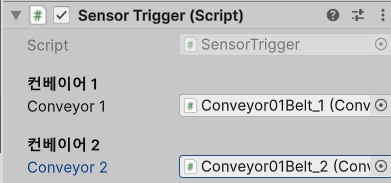

- Product 프리팹에 `Product` 태그 생성 지정

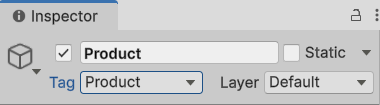

#### 벨트 동작화면

https://github.com/user-attachments/assets/c232dd7f-d635-413a-83e9-4077c8002f4a

#### 컨베이어, 스폰 기능 동기화

- 센서가 감지되면 Conveyor와 Spawner를 같이 중지
- BoxSpawner.cs 수정, isRunning 추가

```cs
private bool isRunning = true;

void Update() {
    if (!isRunning) return;  // isRunning이 false면 아래 로직 실행안함
    timer += Time.deltaTime;   // HW 성능별 FPS 고정

    if (timer >= interval) {
        timer = 0;
        Instantiate(prdPrefab,
                    transform.position,
                    Quaternion.identity);
    }
}

public void Stop() {
    isRunning = false;
}

public void StartSpawner() {
    isRunning = true;
} 
```

- SensorTrigger.cs 수정, BoxSpawner 변수 추가

```cs
...
[Header("박스생성기")]
public BoxSpawner spawner;

...

private IEnumerator Process() {
    isProcessing = true;

    Debug.Log("제품 감지 - 컨베이어/스폰 중지");
    conveyor1.Stop();
    conveyor2.Stop();
    spawner.Stop(); // 스포너 중지 추가

    yield return new WaitForSeconds(3.0f);

    conveyor1.StartBelt();
    conveyor2.StartBelt();
    spawner.StartSpawner(); // 스포너 시작 추가
    Debug.Log("컨베이어/스폰 재시작");

    yield return new WaitForSeconds(1.0f); 

    isProcessing = false;
}
```

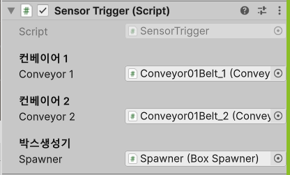

#### 최종 실행결과

https://github.com/user-attachments/assets/85e158e2-e7bc-4922-9ede-eeb609d1b39a

---

### 2.4. ProBuilder 

#### 개요

- Unity에서 건물이나 여러 오브젝트를 손쉽게 만들 수 있도록 도와주는 패키지
- 3D 모델링 기능이 없는 Unity를 Blener처럼 모델링할 수 있도록 지원
- Blender 만큼 강력하지는 않음

#### 설치

- Windows > Package Manager > Unity Registry에서 `ProBuilder` 검색 후 설치

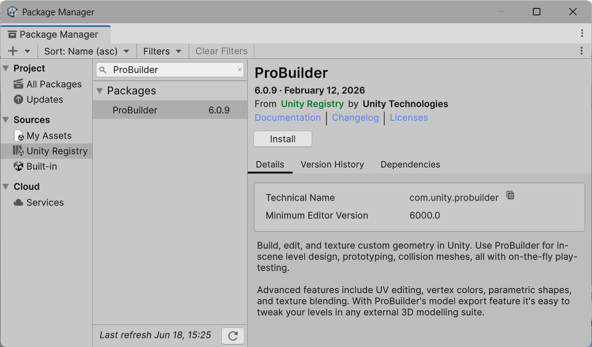

#### 사용법

- 메뉴 Tools > ProBuilder > Create Shape > 오브젝트 선택

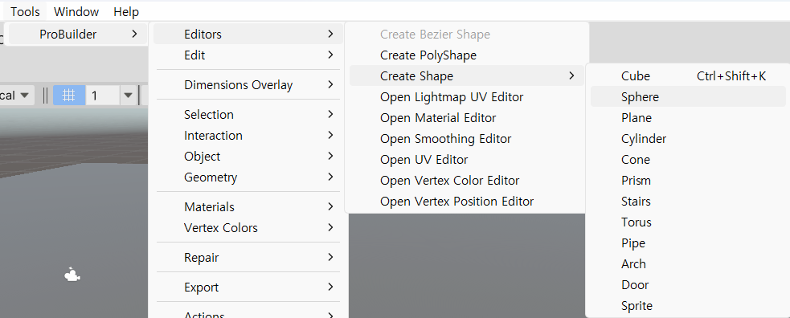

- Heirarchy 창 > 마우스 오른쪽 > ProBuilder > 오브젝트 선택

- 프로빌더로 생성한 오브젝트 선택 후
- Scene 뷰 툴바 > ProBuilder 선택

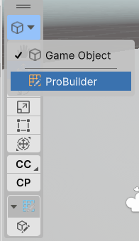

- 상단 툴바에 프로필더 아이콘 버튼 추가

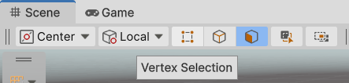

- Cube 상태에서...
- Vertex Selection(점 선택), Edge Selection(선 선택), Face Selection(면 선택)
- Move, Rotate, Scale 기능으로 오브젝트 Shape를 변형

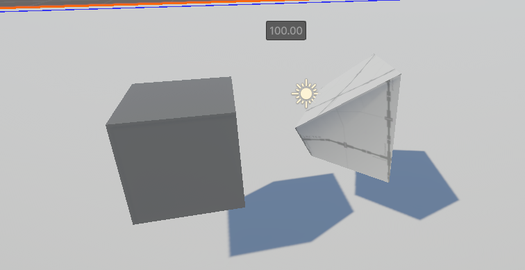

- 3D 모델링툴 Blender와 유사한 기능

#### Tip

- 바닥 오브젝트(Plane)와 다른 오브젝트(Cube 등)를 공간없이 
    - Cube에서 V 키 누른 상태에서 위치이동

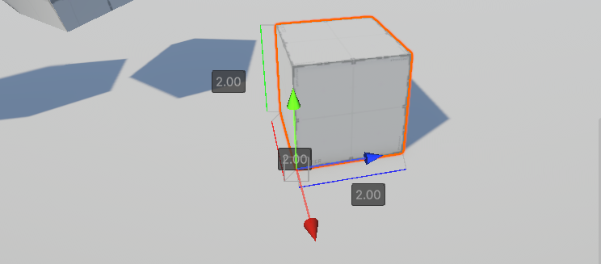

#### 오브젝트 변형법

- Probuilder 큐브 생성
- 변형툴바 Probuilder 선택
- Face Selection 클릭, 앞쪽세로면 선택 Move 기능으로 확장

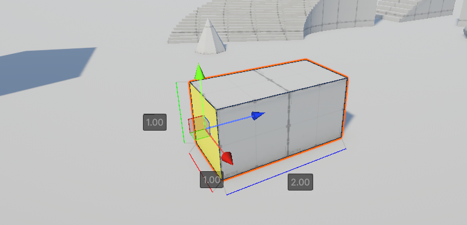

- Edge Selection 클릭, 왼쪽상단 선 선택 Move 기능으로 축소

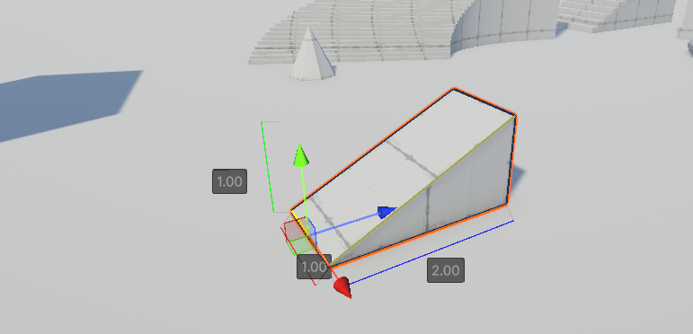

- Face.. 클릭 반대편 면 클릭, Context Menu > Extrude Faces 클릭

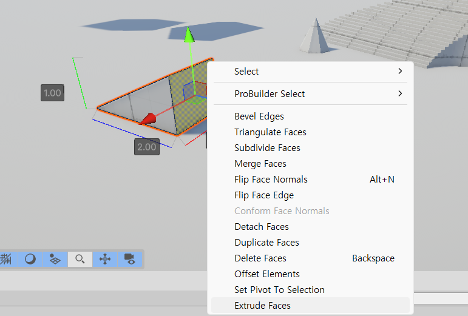

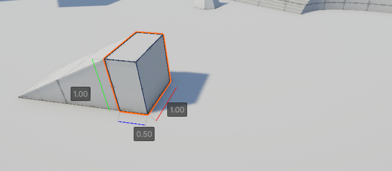

- Move, Rotate, Scale 사용 - 모양을 변형
- Face.. 클릭, Cube 상단 클릭
- Shift 누른 상태에서 Scale 조정

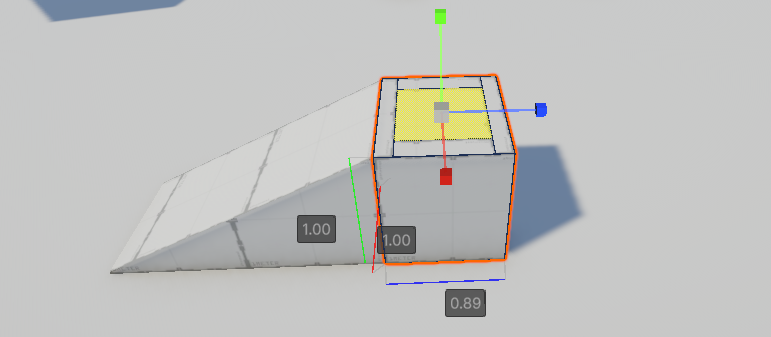

- Context Menu > `Extrude Faces` 클릭

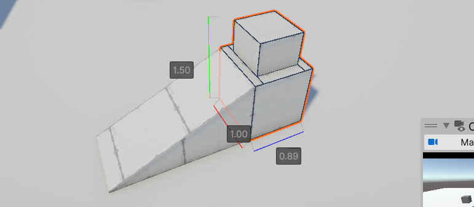

- Edge... 클릭. 최상후면 선 클릭 > Bezel Edge 선택

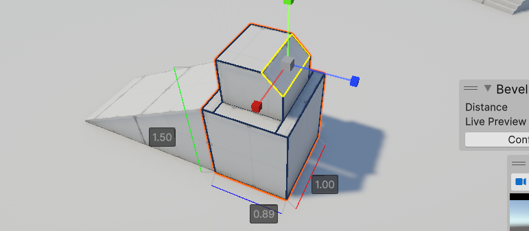

- Edge를 여러개 선택 > Bezel Edge 선택

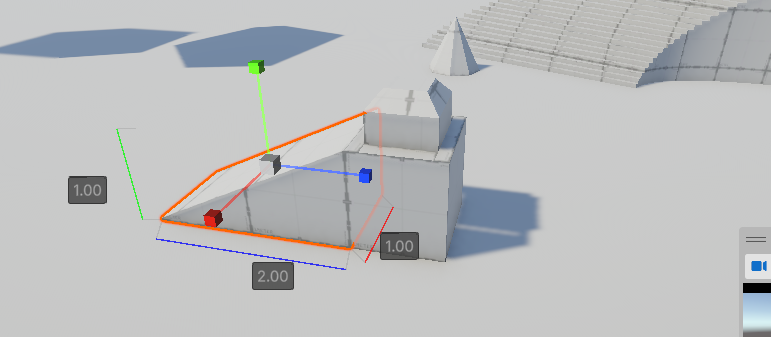

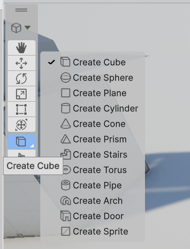

- 바닥에서 1번 마우스 드래그드롭으로 x, z 넓이 생성, 2번 드래그드롭으로 y 높이 생성

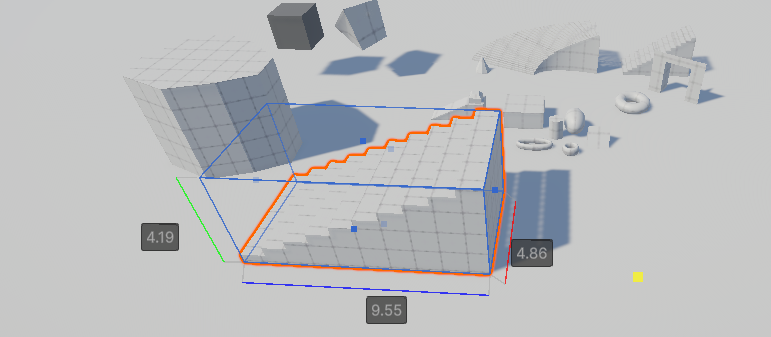

#### 큐브형태 벽 생성

- 기존 큐브 > Face 선택 > Scale 선택
- Shift 누른 상태에서 크기조정

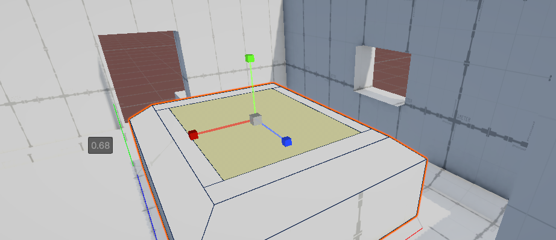

- 원본 면 크기보다 작게 조정가능
- Move 선택
- Shift 누른 상태에서 위치이동

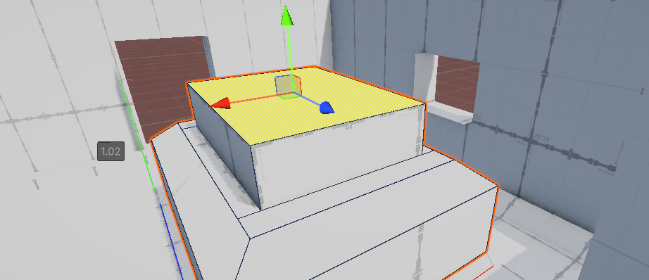

- 반복작업, 벽 생성

#### 문, 창문 만들기

- 직교기준 Edge 선택 > Context Menu > Insert Edge Loop 클릭

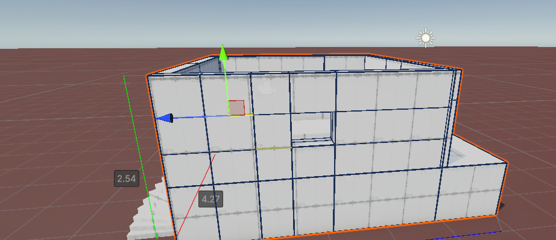

- 창문, 문 위치 Face 선택 > Move 선택, 창문/문 내려는 방향으로
- Shift 누른 상태에서 이동

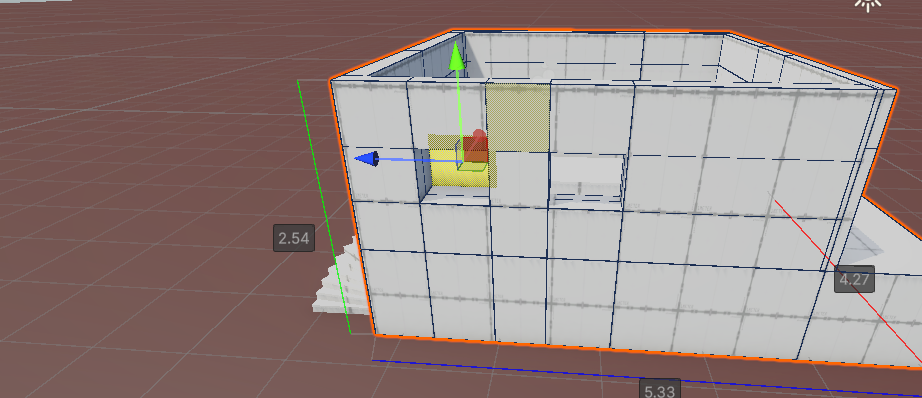

- Context Menu > Delete Face 선택
- 반대편 면에서도 Delete Face 선택

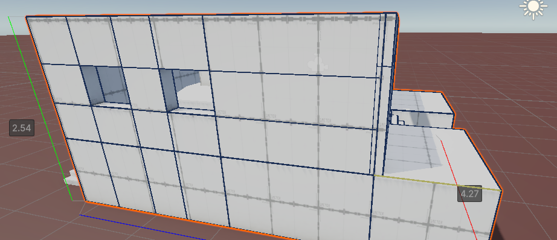

#### 재질 적용

- Asset Store Web > Material 검색 > 애셋 추가
- Unity Editor Import

- Tools > ProBuilder > Editors > Material Editor 클릭

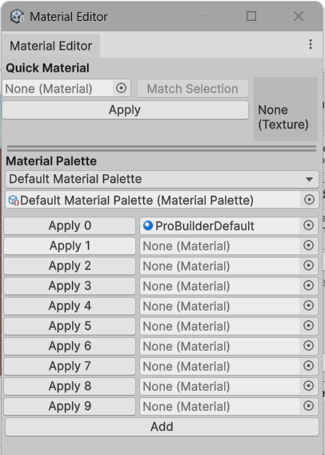

#### Material 렌더링 문제

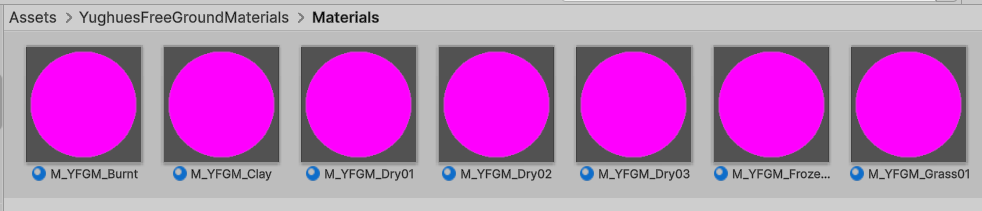

- Window > Rendering > Render Pipeline Converter 선택
- Scan

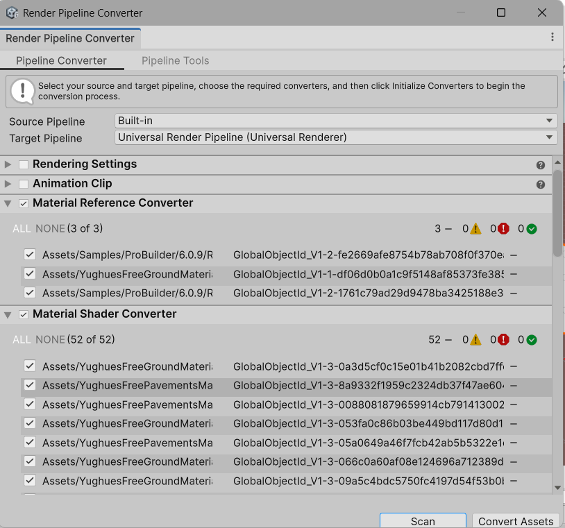

- Convert Assets 버튼 클릭

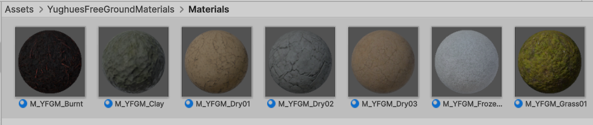


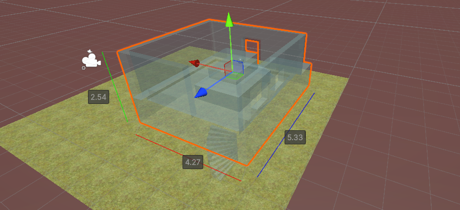

---

### 2.3. Unity Factory HDRP

- Unity Technologies Japan에서 제공하는 무료 HDRP 공장 시뮬레이션 에셋
- 공장건물부터 컨베이어라인, 로봇팔, 작업자, 조명...
- https://assetstore.unity.com/ 에서 `Unity Factory` 검색

#### 프로젝트 생성

- HighDefition 3D(HDRP) 프로젝트 생성
- My Assets에서 Unity Factory 검색 후 Import


- Import 후 오류 발생
  - SplineContainer 에러
    - Package Manager > Unity Registry, `Splines` 검색 후 설치
  - Input System 오류
    - 키보드, 마우스 입력 시스템이 Unity 6부터 변경
    - 예전 방식 입력시스템 사용
    - Project Settings > Player > Other Settings > `Active Input Handling`, Old 또는 `Both`로 변경 후 에디터 재시작


- Global Volume 오브젝트, 사용체크 비활성화


- 기존 Scene을 다른이름으로 재저장
- 계층창 오브젝트를 확인하면서 삭제

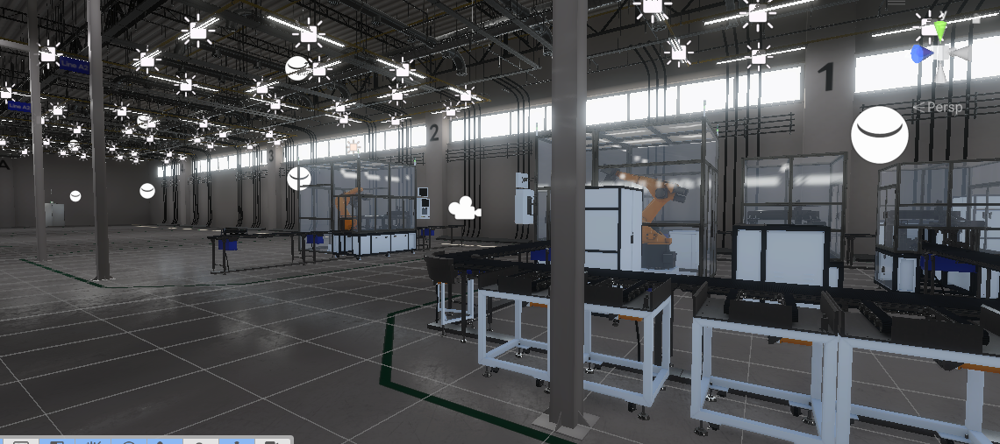

#### Spline 애니메이션 기능

- 컨베이어 위 생산품 움직임, 작업자 이동 기능
- 설치한 Splines 기능 사용
- Hierarchy 창 > Create > Spline > 하위메뉴 선택

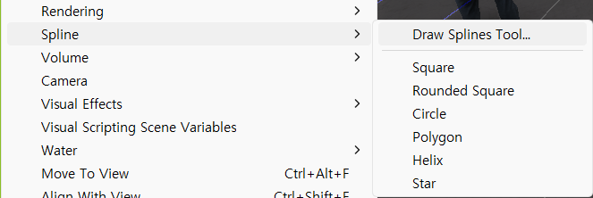

- 움직일 오브젝트 선택 > Add Component > Spline Animate 추가
- Spline 속성 > 적용한 Spline 지정
- Movement Method Time Duration 변경

https://github.com/user-attachments/assets/8805de0b-a617-4fc5-939c-fb3e14c67de6

#### Product Spline 애니메이션

- TODO : 
- 컨베이어 위 생산품 동작 기능
- 컨베이어 생산라인 매핑되는 Spline 생성
- 이동 후 로봇팔 챔버에 도착하면 동작 멈춤
- 일정시간 로봇팔 애니메이션 발생
- 생산품 Spline 위로 이동
- CustomSplineAnimate.cs 확인 필요

### 2.4. IoT Sample Project 

- IoT Sample Project 애셋

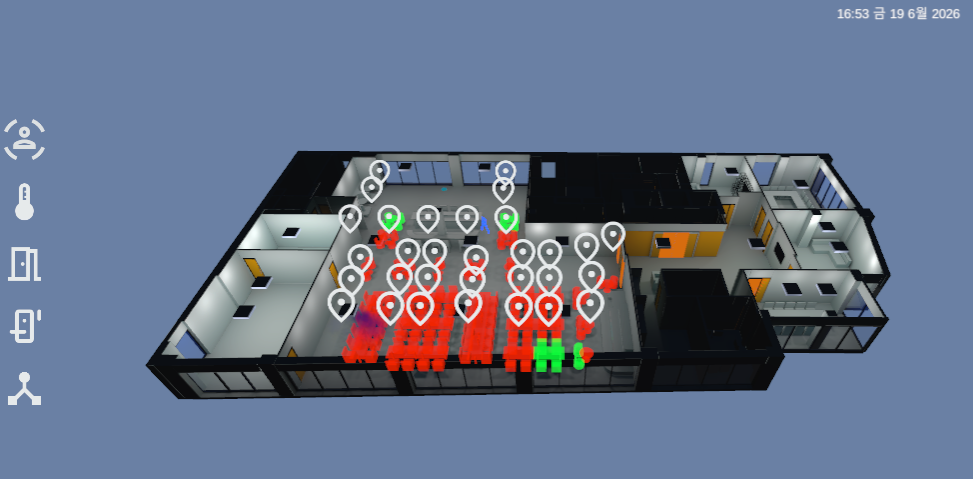

#### 전체 분석

- IoT Sample Scene 오픈
    - Hierarchy 창 맨 위 오브젝트부터 분석 시작

- 프로젝트창
    - IotConnector 폴더 - IndustryCSE.IoT 네임스페이스 사용

- 게임오브젝트 활성화 구분
    - activeSelf - 자기자신이 활성상태인지 여부
    - activeHierarchy - 부모오브젝트 포함해서 활성상태 여부

1. Canvas UI 클릭
    - Top Menu Bar 아래 구성 확인
    - btn - Cloud 불필요, 사용체크 해제/비활성화
    - Date and Time 오브젝트
        - DateTimeGenerator.cs 스크립트 더블클릭
        - yyyy-MM-dd HH:mm:ss 포맷팅으로 변경

    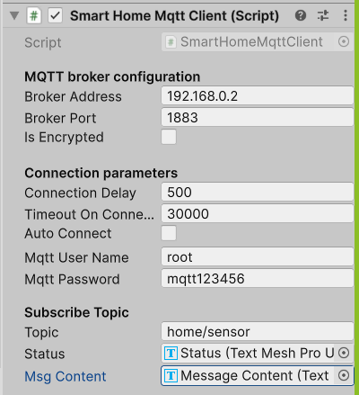

2. ControlSystem - Canvas UI 왼쪽 버튼집합
    - Button - 캔버스 사용시 재일 중요

    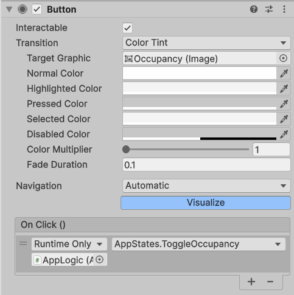

    - On Click() 이벤트 확인
    - AppStates.ToggleOccupancy()
        - AppLogic 빈 그룹오브젝트 연결
        - AppStates.cs가 컴포넌트로 연계

    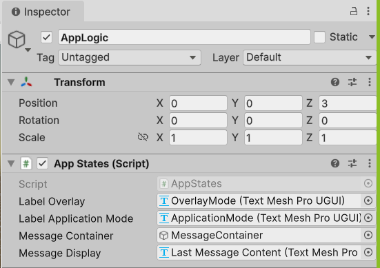

    - AppStates.cs 스크립트 분석/수정

    - 한글 폰트 Assets에 복사
    - Window > TextMeshPro > Font Asset Creator 선택
    - 폰트 선택
    - Character Set > Custom Range
    - `32-126,44032-55203,12593-12643,8200-9900` 지정
    - Generate Font Atlas 클릭

    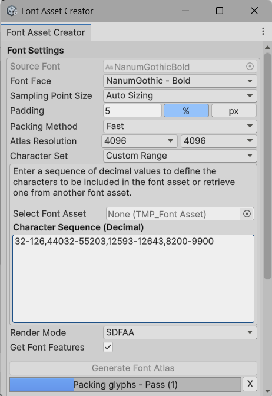

    - 완료후 Save As... 리소스 폴더에 저장

    - OverlayMode TextMeshPro 컴포넌트에 폰트 지정

    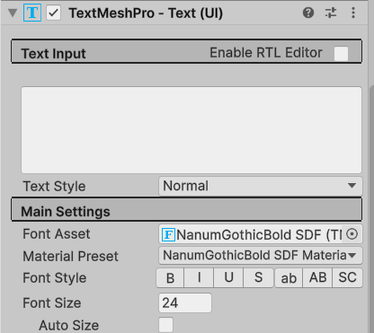

    - 실행

    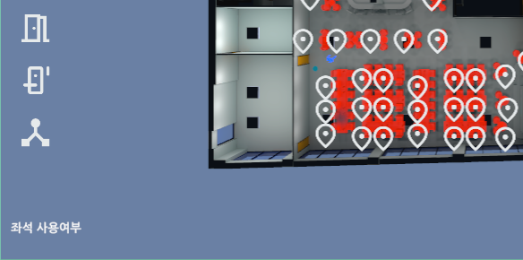

    - AppState에 적용된 폰트 변경 처리

3. Camera 
    - CameraController.cs - 물체를 기준으로 화면을 회전, 줌인아웃 기능

4. BrightonOffice 오브젝트
    - 3DMax, Blender 같은 3D 모델링 툴에서 작업 3D 사무실 모델
    - Brighton_Floor_4 - 분석의미 없음    
5. BrightonOffice.Plane
    - NavMesh Surface

   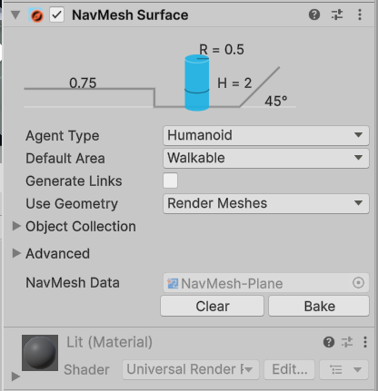 

   - NPC나 로봇이 길을 찾기 위해 사용하는 이동가능한 바닥정보
   - 로봇청소기의 경우 프리팹에 길이 셋팅되어 있음. Prefabs > AI BOTS 클릭

   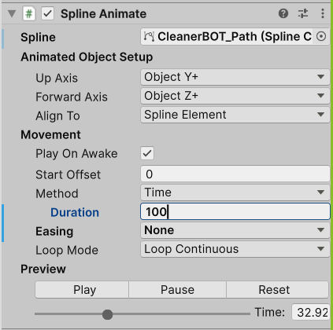

   - NavMesh - 벽이나 장애물 피하고, 이동가능한 바닥만 따라다니게 미리 계산해놓은 객체
    - Agent Type - 어떤 캐릭터사 사용할지 결정
    - Default Area - Walkable(이동가능), Not Walkable(이동불가), Jmp(점프필요)

    - Bake(굽기) 버튼 - 바닥분석 후, 이동가능한 영역 계산 후 새로운 NavMesh 생성
    - 중간에 바닥을 막는 오브젝트가 존재하면 NavMesh가 분리됨

    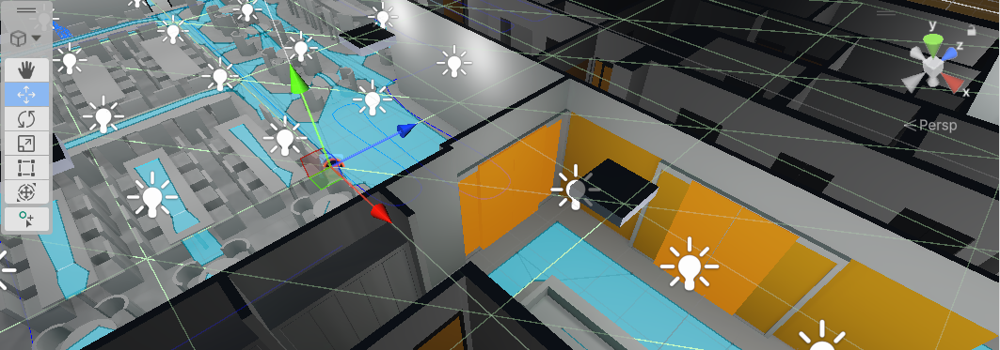

    - 문 등의 오브젝트를 제거하고 Clear후 재 Bake 

    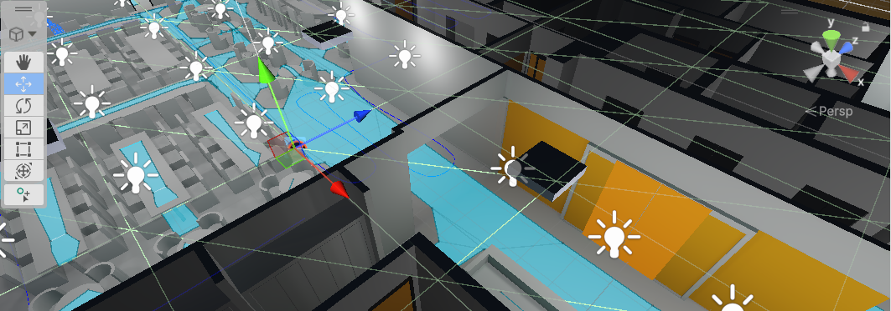


6. IoTDevices - 오피스에 위치하는 IoT 센서 장비들에 대한 설정

7. DeviceSimulator - IoT 시뮬레이션을 위한 더미데이터 생성용 클래스

8. AppLogic - Humanoid, Robot청소기 동작 처리용 오브젝트

    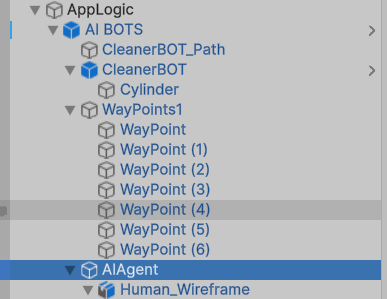

    - AIAgent - Humanoid 오브젝트 PathWalker 스크립트 컴포넌트에 WayPoint 7개 이미지정
    - WayPoint 위치 변경하면, NavMash Surface를 자동으로 이동

9. MQTT Connector - IoThub.MqttMessageProvider.cs(MQTT 브로커 연결용), IoTHub.IotDeviceMessageReader(MQTT 메시지 읽기용) 스크립트로 구성

#### 분석 및 수정 결과화면

- 동영상

### 2.5. WPF Dummy IoT 연동 프로젝트

- IoT Sample Project는 M2Mqtt 라이브러리로 동작
- MQTTnet으로 진행

#### Unity Project 생성

- URP로 프로젝트 생성
- Asset Store에서 `Low Poly`로 검색 후 Free 클릭
    - Cute Magic – Stylized Low Poly Interior Pack
    - Cute Low Poly Furniture Pack
    - Pandazole - 저 폴리 에셋 번들

#### 방 구성

- Pandazole Home Interior 애셋으로 구성

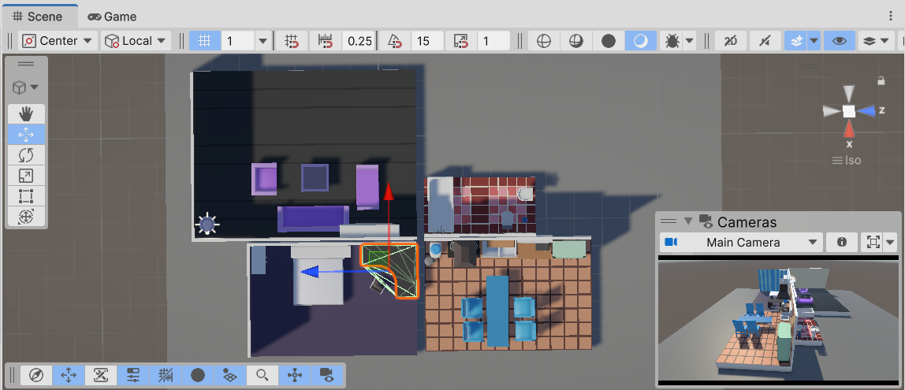

#### 한글폰트 설정

<!-- 문서내 링크 -->
[전체분석내 폰트설정](#전체-분석)

#### NuGet 패키지 불러오기

- Github 에서 [NuGetForUnity](https://github.com/GlitchEnzo/NuGetForUnity) 설치

    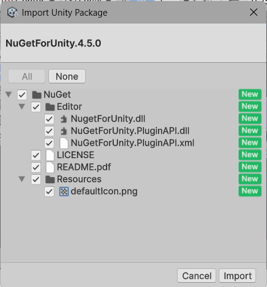

- MQTTnet 은 DLL을 직접 가져와서 구성. MQTTnet 버전 충돌
- MQTT for Unity(M2Mqtt)를 사용

#### M2MqttUnity 설치

- M2Mqtt를 유니티 스크립트로 재정의해서 Unity에서 사용할 수 있게 만든 버전
- https://github.com/gpvigano/M2MqttUnity Code zip으로 다운로드
- 압축해제 후 
- Project 창 Assets에 M2MqttUnity 압축해제한 Assets 폴더 복사
- Unity에서 컴파일 진행

- 테스트 

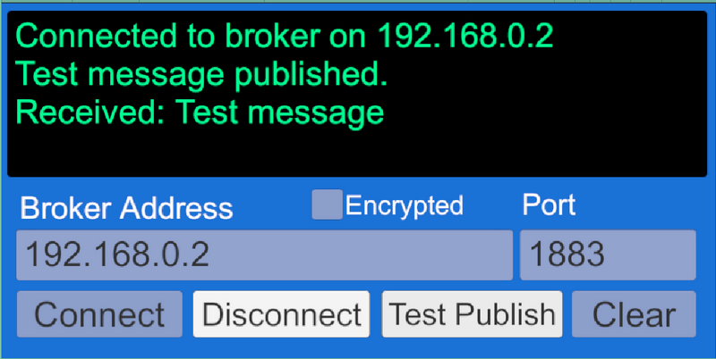

- MQTT Publish 메시지 확인

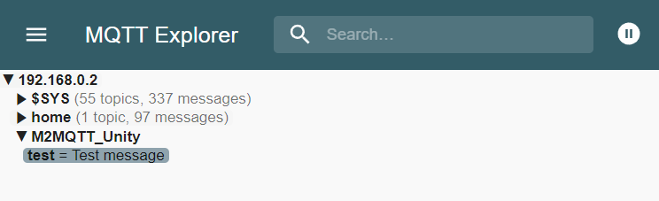

#### Unity MQTT Subscribe 메시지 수신

- Canvas UI와 TextMeshPro, Image 등으로 화면 구성

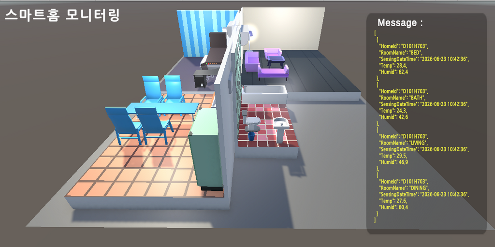

- SmartHomeMqttClient.cs 작성
- 빈 객체 생성 > MqttClient 명명
- 위 스크립트 컴포넌트 지정
- Inspector에서 필요 데이터 입력, Broker Address, User Name, Password
    - TOPIC, 상태표시 TextMesh Pro, JSON 데이터 출력 TextMesh Pro 지정


- IoT Sample Project 애셋에서 CameraController.cs 가져오기

- Essentials Pathway 애셋에서 SkyBox 머티리얼 가져와서 적용

#### 전체 실행결과

https://github.com/user-attachments/assets/611f0e5b-cb74-48d4-87b7-5a76254847d1

---

### 2.9. Unity Factory 컨버전

- 결론 URP를 지원하는 HDRP 애셋 사용이나
- URP 머티리얼을 새로 만드는 것을 권장
- Unity Factory HDRP버전, URP 지원안함
- URP 프로젝트 생성, Unity Factory 에셋 Import 

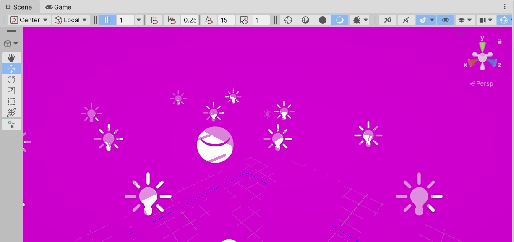

- Package Manager > `Universal Render Pipeline' 검색 후 설치

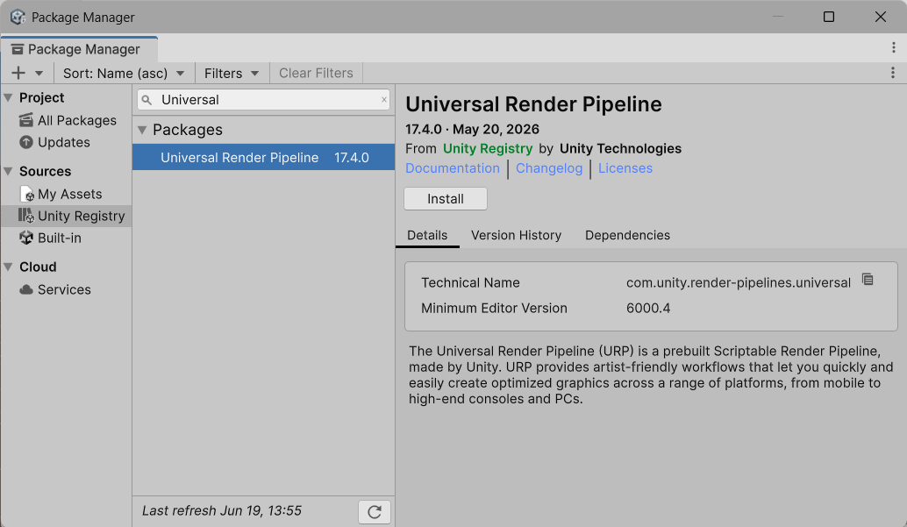

- URP Asset 생성
- 프로젝트창 > Create > Rendering > URP Asset (with...) 선택

- Edit > Project Settings > Graphics > Default Render Pipeline 값을 HDRP 종류에서 위에서 생성한 URP 에셋으로 변경

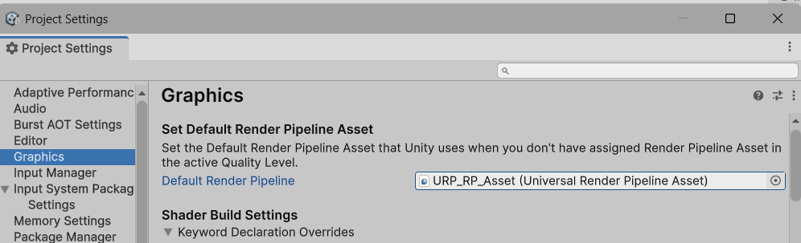

- Edit > Project Settings > Quality > Render Pipelin Asset을 URD로 변경

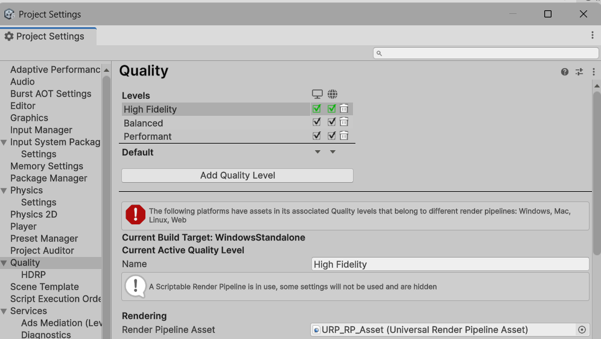

- 머티리얼 변환

- Window > Rendering > Reder Pipeline Converter 선택

[웹개발 학습](./README4.md)